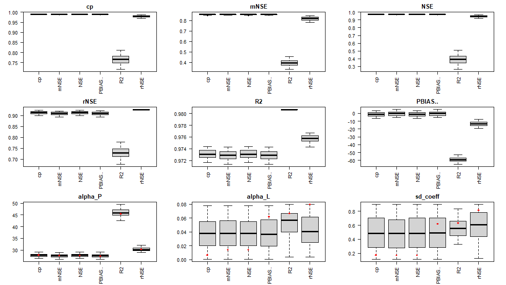
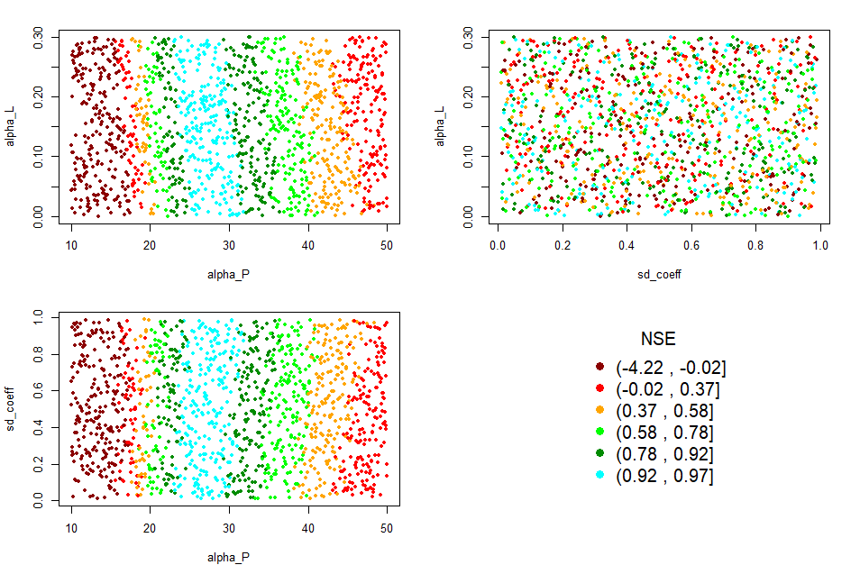

<!-- README.md is generated from README.Rmd. Please edit that file -->

```{r, include = FALSE}
knitr::opts_chunk$set(
  collapse = TRUE,
  comment = "#>",
  fig.path = "man/figures/README-",
  out.width = "100%"
)
```

# GREENeR

<!-- badges: start -->
[](https://www.gnu.org/licenses/gpl-3.0)
<!-- badges: end -->

The goal of GREENeR is to provide a conceptual model to assess nutrient loads (total nitrogen and total phosphorous) from a basin given diffuse and point emissions to the land and river network. The model comprises two major nutrient pathways: diffuse sources that undergo retention in the land phase (basin retention) before reaching the stream, and point sources that are directly discharged into surface waters. Once in the river network, all sources are reduced by the in-stream retention (river retention).

## Installation

You can install the development version of GREENeR from GitHub with:

```{r installation, eval=FALSE}
# install.packages("devtools")
devtools::install_github("calfarog/GREENeR")
```

## Illustrative Example

This is a basic example which shows how GREENeR works, for a more detailed illustration, please see our [vignettes](https://calfarog.github.io/GREENeR/articles/GREENeR.html).

GREENeR functionalities are illustrated for the [Lay river](https://en.wikipedia.org/wiki/Lay_(river)) basin, in France. Please note that the basin data are extracted from a pan-European dataset (Grizzetti et al. 2021) for the purpose of showing the package tools and the analysis steps for a generic region.

## Model calibration
The quality of model calibration depends on the quality and number of available observations. To run the calibration process for a scenario (function **calib_green()**), the following settings must be defined:

1. The expected range for each parameter. This range is defined by two vectors of three values, one for the lower limits and one for the upper limits of the three parameters. The values correspond to each of the parameters of the model in sequence: alpha_P, alpha_L, and sd_coeff.

2. The number of iterations to be performed during the calibration process. The higher the number of iterations, the more likely it is to achieve quality parameters, but the longer the computation time required.  Although it depends on the catchment and the proposed intervals, it is recommended to run at least 200 iterations to have enough information to continue the calibration process.

3. The years to be included in the calibration process.

This is a basic example which shows you how to solve a common problem:

```{r example}
library(GREENeR)

data("catch_data_TN")
data("annual_data_TN")

# Parameter for the calibration of the model
# the lower limits for all params (alpha_P, alpha_L, sd_coef)
low <- c(10, 0.000, 0.1) 
# the upper limits for all params (alpha_P, alpha_L, sd_coef)  
upp <- c(50, 0.08, 0.9)       

# number of iterations
n_iter <- 2000    

# years in which the model should be executed
years <- c(2003:2009)
```

A calibration of TN in the Lay basin is performed with the parameters indicated above. The process is parallelised and will use all the cores of the computer. The computation time depends on the computer, the basin, and the number of iterations.

```{r calibration, message=FALSE, eval=FALSE}
# execution of the calibration  
DF_calib_TN <- calib_green(catch_data_TN, annual_data_TN, n_iter, low, upp, years)
```

The calibration function applies a Latin Hypercube sampling scheme to the three parameters within the possible range (defined by lower and upper limits) and evaluates model performance (predictions against available observations) for the calibration period (specified in ‘years’) by calculating several "goodness-of-fit" metrics. The function returns a dataframe with parameters and goodness-of-fit scores that can be further analyzed.

The function applies the following goodness-of-fit metrics (Althoff and Rodrigues 2021):

+ NSE: Nash-Sutcliffe efficiency 
+ rNSE: Relative Nash-Sutcliffe efficiency 
+ mNSE: Modified Nash-Sutcliffe efficiency 
+ cp: Coefficient of Persistence 
+ VE: Volumetric Efficiency 
+ KGE: Kling-Gupta efficiency 
+ d: Index of Agreement 
+ md: Modified index of agreement 
+ rd: Relative Index of Agreement 
+ r: Linear correlation coefficient 
+ R2: Coefficient of determination
+ PBIAS: Percent bias 
+ MAE: mean absolute error
+ RMSE: Root mean square error
+ ME:  Mean error 
+ MSE: Mean square error 
+ NRMSE: Normalized Root Mean Square Error

## Exploring calibration results and visualization tools

Choosing the right goodness-of-fit metric to select the best set of parameters for a model largely depends on the overall study scope, the area of interest (e.g. high or low load, upper or lower catchment area), and the available observation dataset (size and quality). The library includes a series of functions to examine the calibration results and help select the most suitable set of parameters.

##### Calibration boxplot

```{r calib_boxplot, message=FALSE, eval=FALSE}
# Generating the box plots  
rateBS <-  5  #  percent of parameters selected from the whole calibration set
calib_boxplot(DF_calib_TN, rateBS)
```

```{r boxplot, echo=FALSE, out.width='100%'}

```

##### Calibration dot plot

```{r calib_dot, message=FALSE, eval=FALSE}
# Generating the dot plots  
Gof_mes <- "NSE"
calib_dot(DF_calib_TN, Gof_mes)
```

```{r dot_plot, echo=FALSE, out.width='100%'}

```

##### Calibration scatter plot

```{r calib_scatter, message=FALSE, eval=FALSE}
# Generating the scatter plots  
Gof_mes <- "NSE"
scatter_plot(DF_calib_TN, Gof_mes)
```

```{r scatter_plot, echo=FALSE, out.width='100%'}
knitr::include_graphics('man/figures/calibration_scatterTN.png')
```

## References

Grizzetti, B. and Vigiak, O. and Udias, A. and Aloe, A. and Zanni, M. and Bouraoui, F. and Pistocchi, A. and Dorati, C. and Friedland, R. and De Roo, A. and others (2021). How EU policies could reduce nutrient pollution in European inland and coastal waters. Global Environmental Change, 69, 102281. https://doi.org/10.1016/j.gloenvcha.2021.102281

Althoff, D., & Rodrigues, L. N. (2021). Goodness-of-fit criteria for hydrological models: Model calibration and performance assessment. Journal of Hydrology, 600, 126674.
