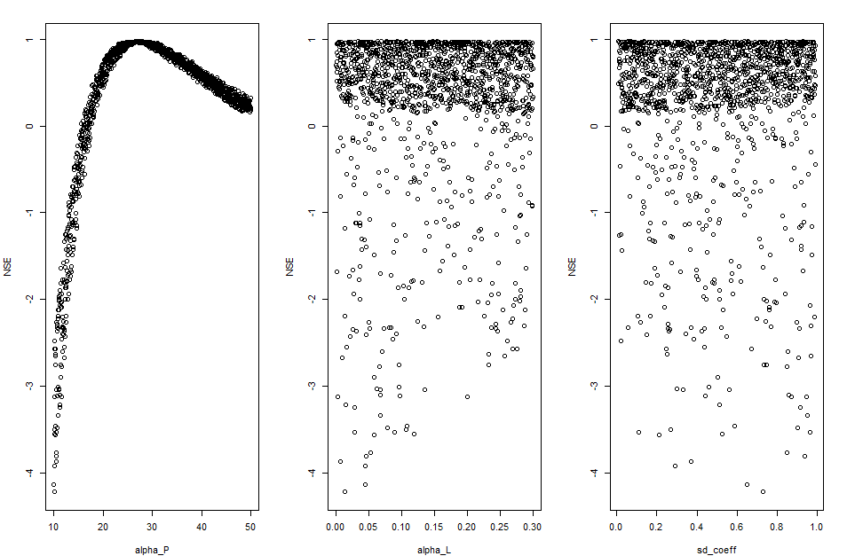

\renewcommand{\[}{\begin{equation}}
\renewcommand{\]}{\end{equation}}

<script type="text/x-mathjax-config">
MathJax.Hub.Config({
  TeX: { equationNumbers: { autoNumber: "AMS" } }
});
</script>

<style>
body {
text-align: justify}
</style>

```{r, include = FALSE}
knitr::opts_chunk$set(
  collapse = TRUE,
  comment = "#>"
)
```

---
**This Vignette illustrates how to use the GREENeR package for assessing annual time series of nutrient (total nitrogen TN and total phosphorus TP) loads in surface water from a basin or region of interest, including assessing land and river retention, and contribution shares by source.**

## Description of the tool

GREENeR [@RJ-2023-065] is an open-source R package for assessing annual time series of nutrient loads in a river network and at the basin outlets, and contributions of nutrient sources to these loads. The package provides tools and methods to apply the model Geospatial Regression Equation for European Nutrient losses (GREEN; [@grizzetti2005statistical; @grizzetti2008assessing; @grizzetti2012changes; @grizzetti2021eu]) to an area of interest. A brief description of the model, including sources and parameters, can be found at the end of this document.

The package includes functions to perform graphical summaries of model inputs, calibrate model parameters, run sensitivity analysis checks, and visualize model inputs and outputs through graphs and maps of total loads and contributions by source. The package works for both total nitrogen (TN) and total phosphorus (TP). It allows the analysis of different scenarios of nutrient input in the river basin or region of study. The package is parallel-capable to alleviate the computational burden in large basins.

## An example case: the Lay river Basin
GREENeR functionalities are illustrated for the [Lay river](https://en.wikipedia.org/wiki/Lay_(river)) basin, in France. Please note that the basin data are extracted from a pan-European dataset [@grizzetti2021eu] for the purpose of showing the package tools and the analysis steps for a generic region. Since the dataset may not reflect local sources correctly, implications of results in terms of nutrient fluxes may be incorrect and are not evaluated nor commented herein. 

The package includes two nutrient type scenarios (one for TN and one for TP), with disaggregated information on nutrient inputs for all catchments that compose the basin (spatial resolution of the  Catchment Characterisation Model; [@de2007rivers]). Both input (TN and TP) time series span from 1990 to 2018. The dataset includes also spatial information in vectorial format to enable mapping of tool results.

## Loading and description of the scenario

```{r message=FALSE}
# load the GREENeR package
library(GREENeR)
```

GreeneR needs information on the topology of the catchment and nutrient sources.
All information is contained in two data.frames. **Note that data.frame 
structures and column names must be respected when creating a new dataset, 
otherwise the functions will fail.**

The topology is contained in the data.frame "*catch_data_TN*" (*or 
catch_data_TP*; in the example dataset, the  Lay river Basin topology is 
presented).

```{r}
# load the topological sequence of catchments and complementary info
data(catch_data_TN)
head(catch_data_TN)
```

The fields are defined as follow:

+ HydroID (integer): unique identifier of the catchment 

+ To_catch (integer): unique identifier of the catchment to which the catchment 
goes. Note that for the outlet To_catch == -1

+ Shreve (integer positive): this indicates the Shreve order of the topological 
sequence in the stream network. GREEN resolves sequentially all loads for 
increasing numbers of Shreve order (headwaters, i.e. catchments that do not 
receive water, are Shreve == 1, catchments that receive waters only from Shreve 
1 are Shreve == 2, etc till the outlet) 

+ LakeFrRet (fraction, 0-1): lake retention fraction (Lret in eqs 1, 6, 7). 
Note, this is different for TN or TP module

+ NrmLengthKm (double): normalized length of catchment reach (eq 5) 

The nutrient sources in each catchment per year are contained in the data.frame 
"*annual_data_TN*" for the TN scenario ("*annual_data_TP*" for the TP scenario).

```{r}
# load the sources of TN for each year and catchment
data(annual_data_TN)
head(annual_data_TN)

# load the sources of TP for each year and catchment
data(annual_data_TP)
head(annual_data_TP)
```

In the annual data frames some fields are in common:

+ *BasinID* (integer): unique identifier of the Basin. This may be useful when the
region of interest encompasses more than one basin; all catchments belonging to a same Basin share the same BasinID. 
+ *YearValue* (integer): the year for which data are defined
+ *HydroID* (integer positive): unique catchment identifier (matches the ID in 
catch_data)
+ *NextDownID* (integer positive): corresponds to To_catch 
+ *ForestFraction*: Non-agricultural land cover in the catchment (fraction, FF in 
eqs 6 and 7)
+ *InvNrmRain*: inverse of normalized rainfall (eq 4)
+ *YearlyNMass*: observed annual total nitrogen load (TN ton/yr) from monitoring 
station data where available (NA when no data is present for that catchment and 
year). These data allow calibration of model parameter; thus sufficient observed 
loads are essential for the calibration process.

The other fields specify nutrient sources, and differs in the two nutrient 
scenarios. In the case of TN, fields are:  

+ Atm: Annual nitrogen deposition from atmosphere (ton/yr)
+ Min: Annual amount of nitrogen from mineral fertilisers (ton/yr)
+ Man: Annual amount of nitrogen in manure fertilisers (ton/yr)
+ Fix: Annual amount of nitrogen fixation by leguminous crops and fodder 
(ton/yr)
+ Soil: Annual amount of nitrogen fixation by bacteria in soils (ton/yr)
+ Sd: Nitrogen input from scattered dwellings (ton/yr)
+ Ps: Nitrogen input from point sources (ton/yr)

In the case of TP fields are: 

+ Bg: annual amount of phosphorus background losses (ton/yr; eq 7)
+ Min: annual amount of phosphorus mineral fertilisers (ton/yr)
+ Man: annual amount of phosphorus in manure fertilisers (ton/yr)
+ Sd: phosphorus input from scattered dwellings (ton/yr)
+ Ps: phosphorus input from point sources (ton/yr)

For some functionalities of the GREENeR package, the geographical information of
the catchments is required in the form of an sf (simple feature) object (the sf 
package, Pebesma & Bivand, implements the Simple Features open standard)

```{r}
# load the geographical information of the basin (require for some functionalities)
data(sh_file)
head(sh_file)
```

## Exploring scenario inputs
The library includes functions to examine the nutrient sources in a Basin, and explore how these are applied, either globally, or distributed over time or in space.

A first summary is provided by the `input_plot()` function, which - when option "B" is given, shows the mean annual nutrient loads per source for the whole period of analysis.

```{r, message=FALSE, eval=FALSE}
# the barplot for the Lay TN and TP Scenarios
input_plot(annual_data_TN, sh_file, "Lay", "B")
input_plot(annual_data_TP, sh_file, "Lay", "B")
```

```{r, echo=FALSE, out.width='100%', fig.cap="Barplot for the Lay TN scenario."}
knitr::include_graphics('figures/barplot_LayTN.png')
```

```{r, echo=FALSE, out.width='100%', fig.cap="Barplot for the Lay TP scenario."}

```

By selecting option "D", `input_plot()` returns density plots of nutrient loads per catchment. These are useful to see the distribution of nutrient source inputs in the Basin. The `coef_SD` parameter is a scale factor for the standard deviation of the data. This can be useful for defining the limits on a graph, for example. If cSD is 2, then `xlim` will be calculated as the mean plus two standard deviations, which could represent, for example, 95% of the data in a normal distribution.

```{r, message=FALSE, eval=FALSE}
# the density plots for the Lay TN and TP Scenarios
input_plot(annual_data_TN, "Lay", "D",coef_SD=1, sh_file)
input_plot(annual_data_TP, "Lay", "D",coef_SD=1, sh_file)
```

```{r, echo=FALSE, out.width='100%', fig.cap="Density plot for the Lay TN scenario."}

```

```{r, echo=FALSE, out.width='100%', fig.cap="Density plot for the Lay TP scenario."}
knitr::include_graphics('figures/densityplot_LayTP.png')
```

The function `input_Tserie()` allows to examine the temporal evolution of the inputs. There are two options, the first, displaying cumulative
total amounts by source ("gr1"). 

```{r, message=FALSE, eval=FALSE}
# the time serie plot type 1 (areas)
input_Tserie(catch_data_TN, annual_data_TN, "Lay", "gr1")
input_Tserie(catch_data_TP, annual_data_TP, "Lay", "gr1")
```

```{r, echo=FALSE, out.width="45%", out.height="25%",fig.cap="Time series plot type 1 (areas) for TN and TP.",fig.show='hold',fig.align='center'}
knitr::include_graphics(c("figures/timeserieTN_type1.png","figures/timeserieTP_type1.png"))
``` 

The second, total amounts and by source total amount("gr2")

```{r, message=FALSE, eval=FALSE}
# the time serie plot type 2 (lines)
input_Tserie(catch_data_TN, annual_data_TN,  "Lay", "gr2")
input_Tserie(catch_data_TP, annual_data_TP,  "Lay", "gr2")
```

```{r, echo=FALSE, out.width="45%", out.height="25%",fig.cap="Time series plot type 2 (lines) for TN and TP.",fig.show='hold',fig.align='center'}
knitr::include_graphics(c("figures/timeserieTN_type2.png","figures/timeserieTP_type2.png"))
```

The function `input_Tserie_area()` allows to examine the temporal
evolution of the inputs in relation to the area. There are also two
options, the first, displaying cumulative total amounts by source per
unit area ("gr1")

```{r, echo=FALSE, eval=FALSE}
# the time serie plot type 3 (areas by year and km2)
input_Tserie_area(catch_data_TN, annual_data_TN, sh_file, "Lay", "gr1")
input_Tserie_area(catch_data_TP, annual_data_TP, sh_file, "Lay", "gr1")
```

```{r, echo=FALSE, out.width="45%", out.height="25%",fig.cap="Time series plot type 3 (areas by year and km2) for TN and TP.",fig.show='hold',fig.align='center'}
knitr::include_graphics(c("figures/timeserieTN_type3.png","figures/timeserieTP_type3.png"))
```

The latter graph is particularly useful when the range of catchment
areas is large to compare nutrient application intensity between
catchments. In the Lay river example, these graphs show, among other
things, how the amount of P from mineral fertilization (Min) has
decreased over time, whereas the amount of P from manure has increased.

There is a second alternative for the function `input_Tseries_area()`,
"gr2". This option compares the levels of nutrient inputs in three zones
of the basin (upper, middle and lower part). The upper zone includes the
catchments up to the median (50%) shreve value, the middle zone includes
the catchments from 50% to 75% of the shreve values, and the lower part
includes the catchments from 75% to 100%. At the top of each graph, the
corresponding area of each part is indicated. In the example below, it
can be seen that differences in N inputs between the upper and lower
part of the basin are noticeable over the whole period.

```{r, message=FALSE, eval=FALSE}
# the time serie plot type 4 (by km2 and Shreve)
input_Tserie_area(catch_data_TN, annual_data_TN, sh_file, "Lay", "gr2")
input_Tserie_area(catch_data_TP, annual_data_TP, sh_file, "Lay", "gr2")
```

```{r, echo=FALSE, out.width="45%", out.height="25%",fig.cap="Time series plot type 4, thatcompares the levels of nutrient inputs in three zones of the basin.",fig.show='hold',fig.align='center'}
knitr::include_graphics(c("figures/timeserieTN_type4.png","figures/timeserieTP_type4.png"))
```

The function `input_maps()` shows nutrient inputs distribution in the Basin. The function generates a map for each nutrient source, plus a map (in yellow-green scale) of the total diffuse nutrient sources, which can be contrasted to the point sources map. The first option ("gr1") shows total inputs (kt/year).


```{r, message=FALSE, eval=FALSE}
# the Input Load Map by source type 1 (kt/year)
input_maps(catch_data_TN, annual_data_TN, sh_file, "gr1", legend_position = 3)
```
```{r, echo=FALSE, out.width='100%', fig.cap="Input map by source type 1 for TN scenario"}
#{width=75%} #300px for HTML
knitr::include_graphics('figures/input_mapsTN_type1.png')
```

The legend_position parameter allows you to modify the position where
the legend will be located in the figure. For the TP scenario:

```{r, message=FALSE, eval=FALSE}
# the Input Load Map by source type 1 (kt/year)
input_maps(catch_data_TP, annual_data_TP, sh_file, "gr1", legend_position = 3)
```
```{r, echo=FALSE, out.width='100%', fig.cap="Input map by source type 1 for TP scenario"}
#{width=75%} #300px for HTML
knitr::include_graphics('figures/input_mapsTP_type1.png')
```

Option "gr2" shows inputs per area (in kt/y/km2):

```{r, message=FALSE, eval=FALSE}
# the Input Load Map by source type 2 (kt/y/km2)
input_maps(catch_data_TN, annual_data_TN, sh_file, "gr2", legend_position = 3)
```
```{r, echo=FALSE, out.width='100%', fig.cap="Input map by source type 2 for TN scenario"}
knitr::include_graphics('figures/input_mapsTN_type2.png')
```

For the TP scenario:

```{r, message=FALSE, eval=FALSE}
# the Input Load Map by source type 2 (kt/y/km2)
input_maps(catch_data_TP, annual_data_TP, sh_file, "gr2", legend_position = 3)
```
```{r, echo=FALSE, out.width='100%', fig.cap="Input map by source type 2 for TP scenario"}
knitr::include_graphics('figures/input_mapsTP_type2.png')
```

## Lake Retention

In the Lake Retention section, we note that the scenarios for TN or TP
are also linked with information about lake retention. This data is
often not dependent on the model used to generate the scenario and
includes actual field data. Therefore, viewing the distribution of lake
retention data can be insightful because it directly impacts the
outcomes of the entire GREEN model. The function that carries out this
analysis is `LakeRetent_plot()`.

```{r, message=FALSE, eval=FALSE}
LakeRetent_plot(catch_data_TN)
```

```{r, echo=FALSE, out.width='100%', fig.cap="Lake retention values distribution for TN scenario"}

```

## Observed Load

Under the Observed Load section, we discuss the importance of
information on the annual total nitrogen load (TN ton/yr) or total
phosphorous (TN ton/yr) gathered from monitoring station data, wherever
available. If no data is available for a particular catchment and year,
it is noted as NA. This information is crucial for the calibration
process of the model, as it allows the adjustment of model parameters.
Therefore, having a substantial amount of observed loads is essential
for the calibration process. The package includes a function called
`references_plot()`, which can be used to create a preliminary summary
of the data available at the monitoring stations. Before diving into
calibration it is thus useful to start by exploring observations.

```{r, message=FALSE, eval=FALSE}
TN_ref_values <- annual_data_TN[!is.na(annual_data_TN$YearlyMass),]
nrow(TN_ref_values)
table(TN_ref_values$HydroID,TN_ref_values$YearValue)
  
references_plot(annual_data_TN)
```

```{r, echo=FALSE, out.width='100%', fig.cap="Observed references distribution for TN scenario"}
knitr::include_graphics('figures/references.png')
```

In the example basin there are 22 observations (derived from publicly
available dataset of European Environment Agency,
[EEA](https://www.eea.europa.eu/data-and-maps/data/waterbase-water-quality-icm-1)
for 6 different stations from 2003 to 2009; note however that only one
station has references for all years. (For the TP case there are 58
observations, collected in eight catchments from 1997 to 2012, with one
complete time-series).

## Model calibration

To run the calibration process for a scenario (function
`calib_green()`), the following settings must be defined:

#. The expected range for each parameter. This range is defined by two vectors of three values, one for the lower limits and one for the upper limits of the three parameters. The values correspond to each of the parameters of the model in sequence: alpha_P (eq 4), alpha_L (eq 5), and sd_coeff (eqs 6 and 7).
#. The number of iterations to be performed during the calibration process. The higher the number of iterations, the more likely it is to achieve quality parameters, but the longer the computation time required. Although it depends on the catchment and the proposed intervals, it is recommended to run at least 200 iterations to have enough information to continue the calibration process.
#. The years to be included in the calibration process.

```{r, message=FALSE}
# Parameter for the calibration of the model
# the lower limits for all params (alpha_P, alpha_L, sd_coef)
low <- c(10, 0.000, 0.1) 
# the upper limits for all params (alpha_P, alpha_L, sd_coef)  
upp <- c(50, 0.08, 0.9)       

# number of iterations
n_iter <- 200 

# years in which the model should be executed
years <- c(2003:2009)
```

In the example below, a calibration of TN in the Lay basin is performed
with the parameters indicated above. The process is parallelised and
will use all the cores of the computer. The computation time depends on
the computer, the basin, and the number of iterations.

```{r, message=FALSE, eval=FALSE}
# execution of the calibration  
DF_calib_TN <- calib_green(catch_data_TN, annual_data_TN, n_iter, low, upp, years)
DF_calib <- data.frame(DF_calib)
```

The calibration function applies a Latin Hypercube sampling scheme to
the three parameters within the possible range (defined by lower and
upper limits) and evaluates model performance (predictions against
available observations) for the calibration period (specified in
'years') by calculating several "goodness-of-fit" metrics. The function
returns a data frame with parameters and goodness-of-fit scores that can
be further analyzed.

The function applies the following goodness-of-fit metrics
[@althoff2021goodness]:

-   NSE: Nash-Sutcliffe efficiency
-   rNSE: Relative Nash-Sutcliffe efficiency
-   mNSE: Modified Nash-Sutcliffe efficiency
-   cp: Coefficient of Persistence
-   VE: Volumetric Efficiency
-   KGE: Kling-Gupta efficiency
-   d: Index of Agreement
-   md: Modified index of agreement
-   rd: Relative Index of Agreement
-   r: Linear correlation coefficient
-   R2: Coefficient of determination
-   PBIAS: Percent bias
-   MAE: mean absolute error
-   RMSE: Root mean square error
-   ME: Mean error
-   MSE: Mean square error
-   NRMSE: Normalized Root Mean Square Error

## Exploring calibration results

Choosing the right goodness-of-fit metric to select the best set of parameters for a model largely depends on the overall study scope, the area of interest (e.g. high or low load, upper or lower catchment area), and the available observation dataset (size and quality). The library includes a series of functions to examine the calibration results and help select the most suitable set of parameters.

The `calib_boxplot()` function shows relationships between best parameter sets chosen according to one goodness-of-fit parameter (title of each boxplot) according to one goodness-of-fit metric (title of plot) in relation to others (x label). Only the six metrics that are used most frequently in hydrological calibration are included in this figure. In the lower panel, the figure shows as well the distribution of model parameters in the best parameter sets. The absolute best parameter set according to each goodness-of-fit metrics is marked as red dots in each boxplot. 

```{r, message=FALSE, eval=FALSE}
# Generating the box plots  
rateBS <-  5  #  percent of parameters selected from the whole calibration set
calib_boxplot(DF_calib_TN, rateBS)
```

```{r, echo=FALSE, out.width='100%'}
knitr::include_graphics('figures/calibration_boxplotTN.png')
```

The `calib_dot()` function shows the distribution of parameters in relation to each other for a chosen goodness-of-fit metric. With this function the figure can be generated for all the previously described goodness-of-fit metrics.

```{r, message=FALSE, eval=FALSE}
# Generating the dot plots  
Gof_mes <- "NSE"
calib_dot(DF_calib_TN, Gof_mes)
```

```{r, echo=FALSE, out.width='100%'}
knitr::include_graphics('figures/calibration_dotTN.png')
```

In the example figure, the best results for alpha_P to achieve best NSE are in the range 0.25-0.30 (cyan color), while there are no clear patterns for the other two parameters. Also, no significant interaction between parameters can be appreciated. We can conclude that the most sensitive parameter in this case is alpha_P.
 
The `scatter_plot()` function shows all parameter realizations in the calibration dataset against a selected goodness-of-fit metric to visualize the influence of each parameter on model results. The result depends on the goodness-of-fit metric the user wants to consider. With this function the figure can be generated for all metrics generated by `green_calib()` function.

```{r, message=FALSE, eval=FALSE}
# Generating the scatter plots  
Gof_mes <- "NSE"
scatter_plot(DF_calib_TN, Gof_mes)
```

```{r, echo=FALSE, out.width='100%'}

```

## Selecting the best parameter sets

The best parameter set according to a selected goodness-of-fit metrics can be extracted with the `select_params()` function:


```{r, message=FALSE, eval=FALSE}
Gof_mes <- "NSE" # according the NSE goodness of fit metric
NSE_bestParams <- select_params(DF_calib_TN, Gof_mes)
NSE_bestParams
Param_NSE2 <- as.numeric(NSE_bestParams[2:4])
```

The function can be applied with different goodness-of-fit metric to obtain different potential model realizations:
```{r, message=FALSE, eval=FALSE}
Gof_mes <- "rNSE" 
rNSE_bestParams <- select_params(DF_calib_TN,Gof_mes)
rNSE_bestParams    
Param_rNSE2 <- as.numeric(rNSE_bestParams[2:4])
```
(note that actual values returned by the function could change at each calibration run)

## Annual observed vs predicted values for a parameter set
Once a parameter set has been selected, it is useful to verify graphically the differences between the observations (ObsLoad) and the model predictions (PredictLoad). Included in the tool is the function `simobs_annual_plot()`, which allows a year-to-year comparison of observed and predicted values for a given parameter sets.

```{r, message=FALSE, eval=FALSE}
# annual scatter plot comparing observed vs modeled loads by year
label_plot <- "NSE best params for TN in the Lay" 
Themx <- max(annual_data_TN$YearlyMass, na.rm = TRUE)
simobs_annual_plot(catch_data_TN, annual_data_TN, Param_NSE2[1], Param_NSE2[2], Param_NSE2[3], years, label_plot, Themx)
```

```{r, echo=FALSE, out.width='100%'}
knitr::include_graphics('figures/annual_scatter_vs_modeled_loadsTN.png')
```

## Comparing Observed vs Predicted for two sets of parameters
The best parameter set depends on the goodness-of-fit metric. It is advisable to pre-select alternative parameter sets (according to different GoF) and compare model results, before making the final selection of the parameter set. The `compare_calib()` function shows simultaneously all observations against modelled values obtained from two parameter sets.

```{r, message=FALSE, eval=FALSE}
setPlabels <- c("NSE", "rNSE")    
label_plot <- "Comparing two sets of parameters for Lay TN" 
compare_calib(catch_data_TN, annual_data_TN, Param_NSE2[1], Param_NSE2[2], Param_NSE2[3], Param_rNSE2[1], Param_rNSE2[2], Param_rNSE2[3], years, label_plot, setPlabels)
```

```{r, echo=FALSE, out.width='100%'}
knitr::include_graphics('figures/comparing_twosets_paramsTN.png')
```

At the top left of the figure, the scores of six frequently used goodness-of-fit metrics for the two parameter sets (as identified in setPlabels) are reported.

## Estimation of nutrient fluxes and source contribution in the basin

Once the most appropriate parameter set has been selected, it is possible to run the model to estimate nutrient loads across the basin. 

The function `region_nut_balance()` runs the GREEN model with the selected parameter set, and returns the region nutrient mass balance of the nutrient fluxes for the whole simulation period. The results of this function can be visualized in a Sankey diagram with the function `N4_sankey()`.

```{r, message=FALSE, eval=FALSE}
# Computing the nutrient balance  
years <- c(2003:2009)
Nut_bal_TN <- region_nut_balance(catch_data_TN, annual_data_TN, Param_NSE2[1], Param_NSE2[2], Param_NSE2[3], years, atm_coeff = 0.38)
# Plot the sankey plot with the result of the balance
sank <- N4_sankey(Nut_bal_TN)
```

```{r, echo=FALSE, out.width='100%'}

```

## Share of nutrients
The function `green_shares()` runs the GREEN model with the selected
parameter set and returns for all catchments nutrient loads and
contributions by each nutrient source in the simulation period.

```{r, message=FALSE, eval=FALSE}
years <- c(2003:2009)
basin_sa <- green_shares(catch_data_TN, annual_data_TN, Param_NSE2[1], Param_NSE2[2], Param_NSE2[3], years)
```

The results of the model can be examined by several functions. The
function `nutrient_tseries()` allows to display the time series of the
total load (TN or TP) in the river outlet or the marian region. The
*"gr1"* option shows the temporal evolution of the total load at the
basin outlet in the simulation period.

```{r, message=FALSE, eval=FALSE}
# The title of the plot
plot_title <- "Time series Load Output for the Lay Basin"    
outFile <- tempfile(pattern = "OutletLoad", fileext = ".csv")
nutrient_tserie(basin_sa, plot_title, "gr1", outFile)
```

```{r, echo=FALSE, out.width='100%'}
knitr::include_graphics('figures/timeserie_loadoutputLay_type1.png')
```

The *"gr2"* option shows the temporal evolution of the total load at the
basin outlet in the simulation period with contributions by sources.

```{r, message=FALSE, eval=FALSE}
# Output Load Basin average time series (lines)
nutrient_tserie(basin_sa, plot_title, "gr2")
```

```{r, echo=FALSE, out.width='100%'}
knitr::include_graphics('figures/timeserie_loadoutputLay_type2.png')
```

The function `nutrient_tserie_darea()`, with the option *"gr1"*, shows
the temporal evolution of total load outputs for the upper, central and
lower catchment area.

```{r, message=FALSE, eval=FALSE}
# Total Load in the Basin Outlet by source apportionment time series (lines)
nutrient_tserie_darea(basin_sa, sh_file, "Lay Basin", "gr1")
```
```{r, echo=FALSE, out.width='100%'}

```

The function `nutrient_maps()` shows maps of nutrient loads in the
basin. The option *"gr1"* shows loads by source (in logarithmic scale to
improve the visualization as the differences in a basin may vary over
several orders of magnitude).

```{r, message=FALSE, eval=FALSE}
style <- "log10" 
nutrient_maps(basin_sa, sh_file, "gr1", style, legend_position = 3)
```

```{r, echo=FALSE, out.width='100%'}

```

The "***style***" parameter allows the user to automatically create
breaks by specifying algorithms. Among others, the following styles can
be passed: "fisher", "log10_pretty", "log10", "order", "cont",
"quantile", "jenks".

The alternative *"gr2"* shows the total load at catchment outlets (in
logarithmic scale to improve their visualisation, as the differences
between sources and outlets are usually several orders of magnitude).

```{r, message=FALSE, eval=FALSE}
# Basin Output Total Load  Maps 
nutrient_maps(basin_sa, sh_file, style, "gr2", legend_position = 3)
```

```{r, echo=FALSE, out.width='100%'}

```

The alternative "gr3" produces maps of total load by catchment area (in
kt/km2/y) in the basin.

```{r, message=FALSE, eval=FALSE}
# Basin Output Specific Load by km2 Maps 
nutrient_maps(basin_sa, sh_file, style, "gr3", legend_position = 3)
```

```{r, echo=FALSE, out.width='100%'}
knitr::include_graphics('figures/nutrient_maps_outputLoadsType3.png')
```

## GREEN model equations, sources and resources for input data
The Geospatial Regression Equation for European Nutrient losses (GREEN; @grizzetti2005statistical; @grizzetti2008assessing; @grizzetti2012changes; @grizzetti2021eu) is a conceptual model to assess nutrient loads (total nitrogen and total phosphorous) from a basin given diffuse and point emissions to the land and river network. The model comprises two major nutrient pathways: diffuse sources that undergo retention in the land phase (basin retention) before reaching the stream, and point sources that are directly discharged into surface waters. Once in the river network, all sources are reduced by the in-stream retention (river retention).

Diffuse sources include nutrient from mineral fertilisers, manure application, nitrogen crop and soil fixation, inputs from scattered dwellings (i.e. isolated houses and small agglomerations that are not connected to sewerage systems), and nitrogen atmospheric deposition (for nitrogen module) or background losses (for phosphorus module). Point sources consist of urban and industrial wastewater discharges. Basin retention is modelled as a decay function proportional to the inverse of the total annual precipitation in the catchment; river retention is estimated as a decay function proportional to the river length, considered as a proxy for water residence time. In addition, lake retention is simulated as a function of lakes residence time and average depth.

The basin is divided into spatial subunits (called catchments), which have a given area, a river reach, an in-let node, and an outlet node. The catchments are topologically connected from basin heads to the outlet in cascading sequence. The sequence of nutrient load accumulation through the stream network is defined by @shreve1966statistical order. Nutrient input from the different sources, basin and river retention are simulated in each small catchment and routed through the river network. For each catchment i in the basin, the GREEN nutrient load $L_i$ is estimated by the general equation:

\begin{equation} \label{eq:green_nutrient_load}
  L_i = (1 - Lret_i) * (DS_i * (1 - Bret_i) + PS_i + U_i) * (1 - Rret_i)
\end{equation}

where:

+ $L_i$ = Nutrient load at the catchment outlet (out-node) (ton/yr) 

Sources of nutrients are:

i. $DS_i$ = Nutrient diffuse sources in the catchment (ton/yr)
ii. $PS_i$ = Nutrient point sources in the catchment (ton/yr)
iii. $U_i$ = Nutrient load from upstream catchments (ton/yr)

Sinks of nutrients are:

i. $Lret_i$ = Lake retention (fraction). Lret can be defined according to @kronvang2004nutrient:
\begin{equation}
  Lret_i = 1 - \frac{1}{[1 + (\frac{7.3}{z}) * RT]} \text{(for nitrogen)}
\end{equation}
\begin{equation}
  Lret_i = 1 - \frac{1}{[1 + (\frac{26}{z}) * RT]} \text{(for phosphorus)}
\end{equation}

  where:

  + $z$ average lake depth (m), 
  + $RT$ = hydraulic residence time (yr).
  
  At European scale, average lake depth and hydraulic residence time can be obtained from HydroLAKES database             (https://www.hydrosheds.org/pages/hydrolakes, @messager2016estimating).
  
ii. $Bret_i$ = Basin retention (fraction):
\begin{equation} \label{eq:basin_retention}
  Bret_i = 1 - \exp(-alpha_p * NrmInvRainy)
\end{equation}
where $NrmInvRain$ is the inverse of annual precipitation (in mm) of year y, normalized by the maximum in the dataset:
  $NrmInvRain = (1 / precipitationy ) / max(1 / precipitation))$
  
iii. $Rret_i$ = River retention (fraction):
\begin{equation}
  Rret_i = 1 - \exp(-alpha_l * NrmLengthKmi)
\end{equation}
  
where $NrmLengthKm$ is the length (in km) of the catchment reach, normalized by the maximum in the dataset: $NrmLengthKm$ = (length of catchment $i$ reach, in km) / $max$(Reach length in the basin).

Thus, the inverse of precipitation and the river length are scaled by maximum scaling [@frank1994data]. Note that in this way basin retention varies from year to year according to annual precipitation, whereas river retention for a given catchment is constant. The equation is applied sequentially from the most upstream nodes to the outlet. The model parameters are:

#. the basin retention coefficient ($alpha_p$), which together with annual precipitation in each catchment regulates nutrient retention of diffuse sources $\eqref{eq:basin_retention}$;
#. the river retention coefficient ($alpha_l$), which regulates the river retention per river km.
#. the fraction of domestic diffuse sources that reaches the stream network ($sd_{coef}$). Note that in Europe the amount ot nturients from scattered dwellings is a minor source of nutrients, therefore this parameter is not very sensitive, and a fixed value of $0.50$ is recommended. In other regions of the world however this may not be the case, hence the model in GREENeR package defines this fraction as a calibration parameter.

$\eqref{eq:green_nutrient_load}$ defines the general GREEN function. However, diffuse and point sources are defined differently for each nutrient module, i.e. nitrogen or phosphorus. More specifically in GREEN **nitrogen** model, for the total nitrogen load $L_i$ of catchment $i$ is estimated as:

\begin{equation}
  L_i = (1 - Lret_i) * ((MinN_i + ManN_i + FixN_i + SoilN_i + (1 - FF_i) * AtmN_i) * \\ 
  (1 - Bret_i) + 0.38 * FF_i * AtmN_i + sd_{coef} * SdN_i + PsN_i + U_i) * (1 - Rret_i)
\end{equation}

where:

+ $MinN_i$ = Annual amount of nitrogen from mineral fertilisers (ton/yr)
+ $ManN_i$ = Annual amount of nitrogen in manure fertilisers (ton/yr)
+ $FixN_i$ = Annual amount of nitrogen fixation by leguminous crops and fodder (ton/yr)
+ $SoilN_i$ = Annual amount of nitrogen fixation by bacteria in soils (ton/yr)
+ $AtmN_i$ = Annual nitrogen deposition from atmosphere (ton/yr)
+ $FF_i$ = Non-agricultural land cover in the catchment (fraction) 
+ $SdN_i$ = Nitrogen input from scattered dwellings (ton/yr)
+ $PsN_i$ = Nitrogen input from point sources (ton/yr)
+ $U_i$ = Nitrogen load from upstream catchments (ton/yr).

Note that nitrogen atmospheric deposition losses are split into two parts, i.e. inputs to agricultural land undergo the basin retention (which includes also the crop uptake), while in all other areas (FF fraction) they are reduced by a fixed rate, derived from the literature, before entering into the stream. Background losses for nitrogen are thus estimated as $0.38 * FF * AtmN$. For an atmospheric deposition of $10$ kgN/ha this corresponds to a background of $3.8$ kgN/ha (in line with the values reported by @helsinki2004fourth).

In GREEN **phosphorus** model, the total annual phosphorus load $L_i$ of catchment $i$ is estimated by the equation:
\begin{equation}
L_i = (1 - Lret_i) * ((MinP_i + ManP_i + (1 - FF_i) * BgP_i) * (1 - Bret_i) + FF_i * BgP_i + \\ 
sd_{coef} * SdP_i + PsP_i + U_i) * (1 - Rret_i) 
\end{equation}

+ $MinP_i$ = annual amount of phosphorus mineral fertilisers (ton/yr)
+ $ManP_i$ = annual amount of phosphorus in manure fertilisers (ton/yr)
+ $FF_i$ = Non-agricultural land cover in the catchment (fraction)
+ $BgP_i$ = annual amount of phosphorus background losses (ton/yr)
+ $SdP_i$ = phosphorus input from scattered dwellings (ton/yr)
+ $PsP_i$ = phosphorus input from point sources (ton/yr)
+ $U_i$ = Phosphorus load from upstream catchments (ton/yr)

Note that phosphorous background losses are splited into two parts, with the inputs to agricultural land undergoing basin retention, while in all other areas (FF fraction) they are considered entering into the stream. Background losses for phosphorus are estimated at $0.15$ kgP/ha (in line with the values reported by @helsinki2004fourth).

Assembling input data for running the GREEN model is time consuming. Data sources for application at European scale are described in @grizzetti2021eu. Domestic sources of nitrogen and phosphorus can also be found in @vigiak2020domestic.


# References
